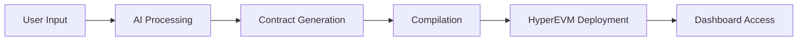

# MintroAI Vesting Creation on HyperEVM - Documentation

## Table of Contents
1. [Overview](#overview)
2. [Architecture](#architecture)
3. [How It Works](#how-it-works)
4. [Deployment Guide](#deployment-guide)
5. [Integration Guide](#integration-guide)
6. [Smart Contract Details](#smart-contract-details)
7. [API Reference](#api-reference)
8. [HyperEVM Specific Features](#hyperevm-specific-features)

## Overview

MintroAI's Vesting Creation feature enables users to deploy and manage token vesting contracts on HyperEVM through an intuitive AI-powered interface. The system handles complex vesting schedules, multiple recipients, and provides a comprehensive admin dashboard for management.

### Key Features
- **AI-Powered Contract Generation**: Natural language to smart contract conversion
- **Flexible Vesting Schedules**: Support for TGE, cliff periods, linear/daily vesting
- **Multi-Recipient Support**: Batch creation of vesting streams
- **Real-time Dashboard**: Monitor and manage all vesting activities
- **HyperEVM Optimized**: Dual-block architecture support for large contracts

## Architecture

```
┌─────────────────────────────────────────────────────────┐
│                     Frontend (Next.js)                   │
├─────────────────────────────────────────────────────────┤
│  AI Chat Interface │ Vesting Form │ Dashboard │ Admin   │
├─────────────────────────────────────────────────────────┤
│                    Backend Services                      │
├──────────────────┬────────────────┬────────────────────┤
│  OpenAI API      │ Solidity       │  Web3/Wagmi        │
│  Integration     │ Compiler       │  Integration       │
└──────────────────┴────────────────┴────────────────────┘
                            │
                    ┌───────▼────────┐
                    │   HyperEVM      │
                    │  Blockchain     │
                    └────────────────┘
```

## How It Works

### 1. Contract Creation Flow



#### Step-by-Step Process:

1. **User Input**: Users describe their vesting requirements in natural language or use the structured form
2. **AI Processing**: OpenAI GPT-4 processes the request and generates contract parameters
3. **Smart Contract Generation**: System creates a customized vesting contract based on parameters
4. **Compilation**: Solidity compiler creates the bytecode
5. **HyperEVM Deployment**: Contract deploys using appropriate block size (small/big blocks)
6. **Dashboard Access**: Users get immediate access to manage their vesting contract

### 2. Vesting Parameters

| Parameter | Description | Constraints |
|-----------|-------------|-------------|
| **TGE (Token Generation Event)** | Initial token release date/time | Must be future date (UTC) |
| **TGE Percentage** | Percentage released at TGE | 0-100% |
| **Cliff Period** | Lock period before vesting starts | 0-24 months |
| **Release Period** | Total vesting duration | 1-120 months |
| **Vesting Type** | Release frequency | Daily or Monthly |
| **Recipients** | Addresses and amounts | Valid EVM addresses |

### 3. Smart Contract Features

- **Stream Management**: Create, update, cancel individual vesting streams
- **Batch Operations**: Add multiple recipients in one transaction
- **Claim Functions**: Individual claim, claim all, or batch claim
- **Admin Controls**: Deposit tokens, update parameters, emergency functions
- **Security**: Owner-only functions, reentrancy protection, safe math

## Deployment Guide

### Prerequisites

```bash
# Required
- Node.js >= 18.0.0
- npm or yarn
- MetaMask or compatible Web3 wallet
- HYPE tokens for gas fees
```

### Environment Setup

1. **Clone the Repository**
```bash
git clone https://github.com/truthdeal/mintro-ai-dapp.git
cd mintro-ai-dapp
```

2. **Install Dependencies**
```bash
npm install
```

3. **Configure Environment Variables**
```env
# .env.local
NEXT_PUBLIC_OPENAI_API_KEY=your_openai_api_key
NEXT_PUBLIC_HYPEREVM_RPC=https://hyperliquid.drpc.org
NEXT_PUBLIC_FACTORY_ADDRESS=0x... # Your factory contract address
```

4. **Deploy Factory Contract** (if not already deployed)
```javascript
// Factory contract handles bytecode deployment
// Deploy using Remix or Hardhat to HyperEVM
```

5. **Run the Application**
```bash
npm run dev
# or for production
npm run build && npm start
```

### Deploying Your Own Vesting Contract

#### Via UI (Recommended):

1. Connect your wallet to HyperEVM (Chain ID: 999 for testnet, 998 for mainnet)
2. Navigate to the vesting creation page
3. Choose between:
   - **AI Chat**: Describe your requirements naturally
   - **Form Interface**: Fill structured fields
4. Review the confirmation dialog
5. Approve the transaction in your wallet
6. Contract deploys automatically with appropriate gas settings

#### Via Code:

```javascript
import { useTokenDeploy } from '@/hooks/useTokenDeploy'

// Example deployment
const { deploy } = useTokenDeploy()

const deployVestingContract = async (bytecode) => {
  try {
    await deploy(bytecode)
    // Contract will auto-detect if big blocks are needed
  } catch (error) {
    console.error('Deployment failed:', error)
  }
}
```

## Integration Guide

### 1. Integrating with Your DApp

```javascript
// Import required modules
import { VestingDashboardStreams } from '@/components/vesting-dashboard-streams'
import { useVestingStreams } from '@/lib/vesting/hooks'

// Use in your component
function YourApp() {
  const contractAddress = "0x..." // Your deployed vesting contract
  
  return (
    <VestingDashboardStreams 
      contractAddress={contractAddress} 
    />
  )
}
```

### 2. Custom Hook Usage

```javascript
// Fetch vesting streams
const { streams, isLoading, error } = useVestingStreams(
  contractAddress,
  userAddress
)

// Create new stream
const { createStream } = useCreateStream(contractAddress, tokenDecimals)

await createStream(
  recipientAddress,
  amount,
  cliffMonths,
  releaseMonths,
  tgePercentage,
  periodDays
)
```

### 3. Direct Contract Interaction

```javascript
import { ethers } from 'ethers'
import hyperVestingABI from '@/constants/hyperVestingABI.json'

const contract = new ethers.Contract(
  contractAddress,
  hyperVestingABI,
  signer
)

// Add a stream
await contract.addStream(
  recipient,
  amount,
  cliff,
  releaseRate,
  tgeRate,
  period
)

// Claim tokens
await contract.claim(streamId)
```

## Smart Contract Details

### Core Functions

| Function | Access | Description |
|----------|--------|-------------|
| `addStream` | Owner | Create new vesting stream |
| `addMultipleStreams` | Owner | Batch create streams |
| `updateStream` | Owner | Modify existing stream |
| `cancelStream` | Owner | Cancel and refund stream |
| `claim` | User | Claim from specific stream |
| `claimAll` | User | Claim from all streams |
| `depositTokens` | Owner | Add tokens to contract |

### Events

```solidity
event StreamAdded(address indexed user, uint256 indexed streamId, uint256 amount)
event Claimed(address indexed user, uint256 indexed streamId, uint256 amount)
event StreamUpdated(uint256 indexed streamId, uint256 newAmount)
event StreamCancelled(uint256 indexed streamId)
```

### Storage Structure

```solidity
struct Stream {
    uint256 totalAmount;    // Total tokens to vest
    uint256 totalClaimed;   // Already claimed amount
    uint256 startTime;      // Vesting start timestamp
    uint256 cliff;          // Cliff period in seconds
    uint40 releaseRate;     // Release rate calculation
    uint16 tgeRate;         // TGE percentage (basis points)
    uint32 period;          // Release period in seconds
    bool active;            // Stream status
}
```

## HyperEVM Specific Features

### Dual-Block Architecture Support

HyperEVM uses a unique dual-block system:
- **Small Blocks**: 1-second intervals, 2M gas limit
- **Big Blocks**: 60-second intervals, 30M gas limit

Our system automatically detects contract size and uses the appropriate block type:

```javascript
// Automatic detection in deployment hook
if (requiresBigBlocks(bytecode)) {
  // Uses bigBlockGasPrice for large contracts
  deployWithBigBlocks()
} else {
  // Standard deployment for small contracts
  deployWithSmallBlocks()
}
```

### Gas Optimization

```javascript
// Optimized gas settings for HyperEVM
const gasSettings = {
  smallBlocks: {
    gas: BigInt(1900000),
    gasPrice: BigInt(1000000000) // 1 gwei
  },
  bigBlocks: {
    gas: BigInt(4000000),
    bigBlockGasPrice: BigInt(1000000000) // 1 gwei
  }
}
```

### RPC Configuration

```javascript
// HyperEVM RPC endpoints
const hyperEVM = {
  id: 999, // Testnet (998 for mainnet)
  name: 'HyperEVM',
  rpcUrls: {
    default: {
      http: ['https://hyperliquid.drpc.org']
    }
  },
  blockExplorers: {
    default: {
      name: 'HyperEVM Scan',
      url: 'https://hyperevmscan.io'
    }
  }
}
```

## API Reference

### Backend Endpoints

#### `/api/create-contract`
Creates and compiles vesting contract.

**Request:**
```json
{
  "name": "Project Token Vesting",
  "tokenAddress": "0x...",
  "parameters": {
    "tgeTimestamp": 1735689600,
    "defaultCliff": 15552000,
    "defaultReleaseRate": 900000000,
    "defaultTgeRate": 1000,
    "defaultPeriod": 2592000
  }
}
```

**Response:**
```json
{
  "success": true,
  "bytecode": "0x608060405234801561001057600080fd5b50...",
  "abi": [...],
  "gasEstimate": "3500000"
}
```

#### `/api/compile-contract`
Compiles Solidity code to bytecode.

**Request:**
```json
{
  "sourceCode": "pragma solidity ^0.8.20; contract Vesting { ... }"
}
```

## Security Considerations

1. **Owner Privileges**: Only contract owner can modify streams
2. **Reentrancy Protection**: Uses checks-effects-interactions pattern
3. **Integer Overflow**: Safe math operations throughout
4. **Time Manipulation**: Relies on block.timestamp (acceptable for vesting)
5. **Access Control**: Role-based permissions for admin functions

## Troubleshooting

### Common Issues

| Issue | Solution |
|-------|----------|
| Transaction fails with "out of gas" | Contract requires big blocks, system auto-switches |
| "Contract size too large" | Automatically handled via dual-block architecture |
| Stream not showing in dashboard | Check if TGE has passed, refresh the page |
| Cannot claim tokens | Ensure cliff period has passed and tokens are vested |
| Approval stuck | Reset MetaMask account or clear pending transactions |

### Support

- **GitHub Issues**: [github.com/truthdeal/mintro-ai-dapp/issues](https://github.com/truthdeal/mintro-ai-dapp/issues)
- **Mail**: [Email](mailto:contact@mintro.ai)

## License

MIT License - See LICENSE file for details

---

*Built with ❤️ for the HyperEVM ecosystem*